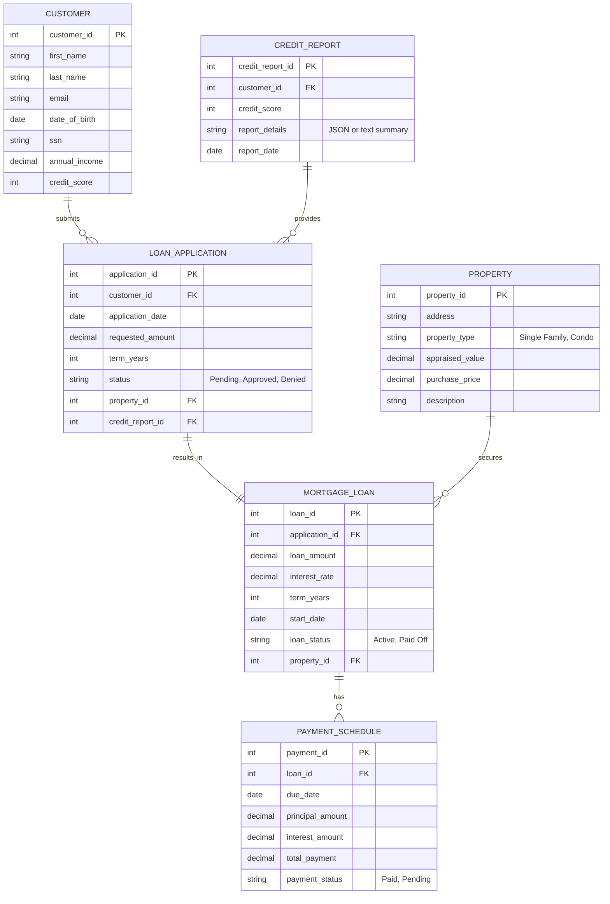

# Home Loans Data Model

This model focuses on mortgage lending: applications, approvals, properties, and repayments.

## Entities and Relationships

## Detailed Descriptions

- **CUSTOMER**: Borrower details, including income and credit score.
- **LOAN_APPLICATION**: Initial request for a home loan.
- **PROPERTY**: Details of the property being financed.
- **CREDIT_REPORT**: Credit history assessment.
- **MORTGAGE_LOAN**: Approved loan terms.
- **PAYMENT_SCHEDULE**: Monthly payment breakdown.

## Data Flow
1. Customer submits application with property details.
2. Credit report is pulled.
3. Application is approved/denied, leading to a loan.
4. Payments are scheduled and tracked.
