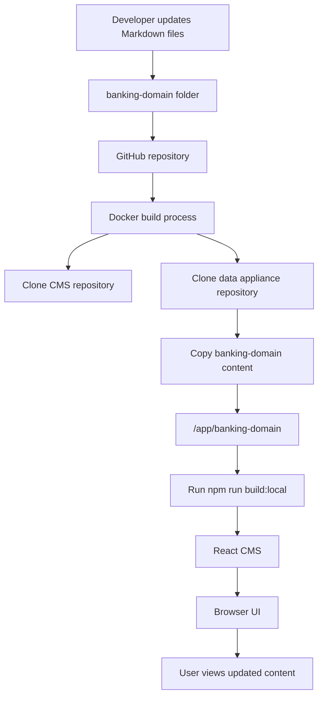
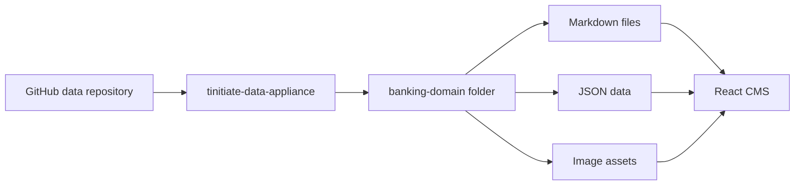
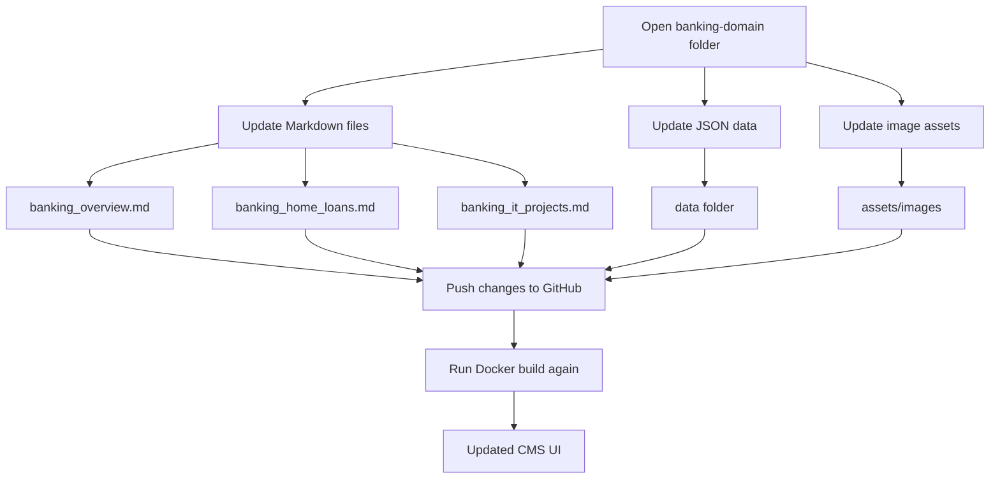
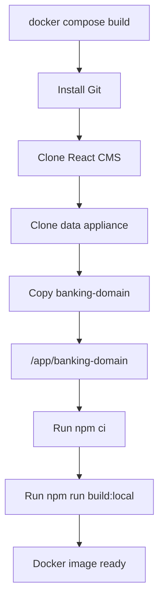
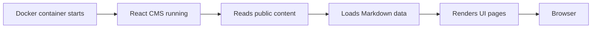
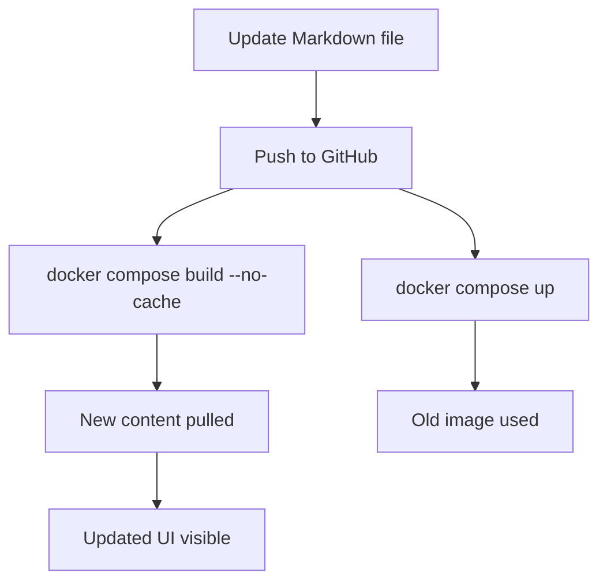
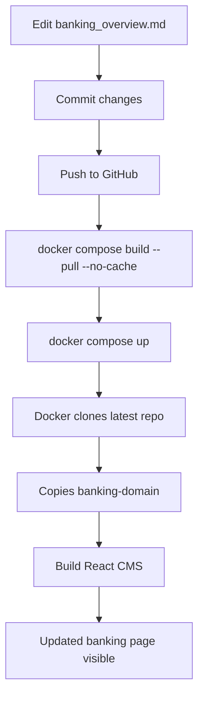

# Banking CMS Content Flow

## Content Update Flow

---

# Where Content Comes From

---

# Where To Update Content

---

# Docker Build Internal Flow

---

# CMS Runtime Flow

---

# Important Update Note

---

# Example Real Flow

