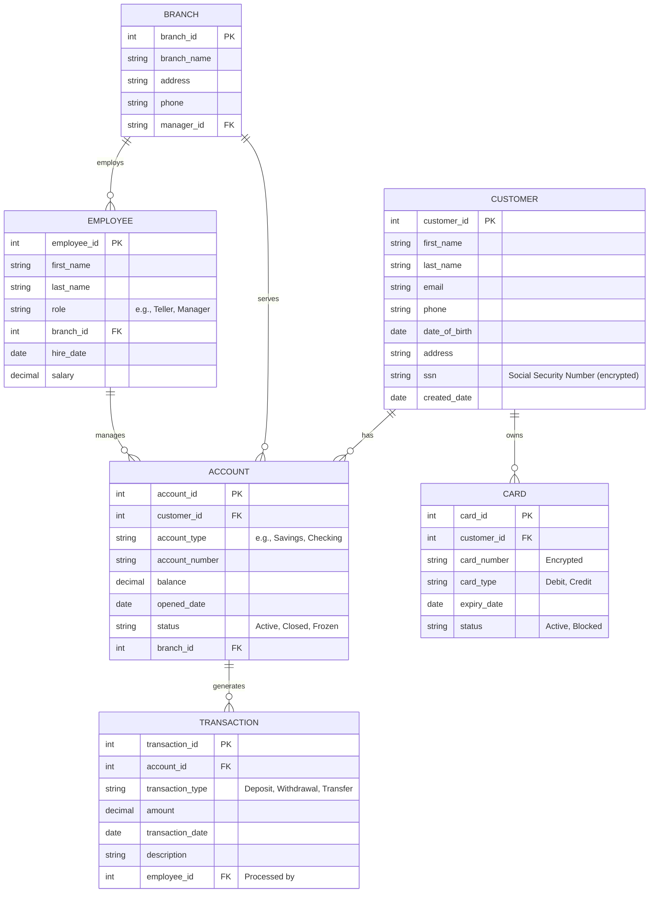

# Regular Banking Services Data Model

This model covers core banking operations: customer management, accounts, transactions, branches, and employees.

## Entities and Relationships

## Detailed Descriptions

- **CUSTOMER**: Stores personal information. Linked to accounts and cards.
- **ACCOUNT**: Represents bank accounts. Each customer can have multiple accounts.
- **BRANCH**: Physical locations. Employees and accounts are associated with branches.
- **EMPLOYEE**: Bank staff. Managers oversee branches.
- **TRANSACTION**: Records all financial activities.
- **CARD**: Debit/credit cards issued to customers.

## Data Flow
1. Customer opens an account at a branch.
2. Transactions are processed via accounts.
3. Employees manage operations.
