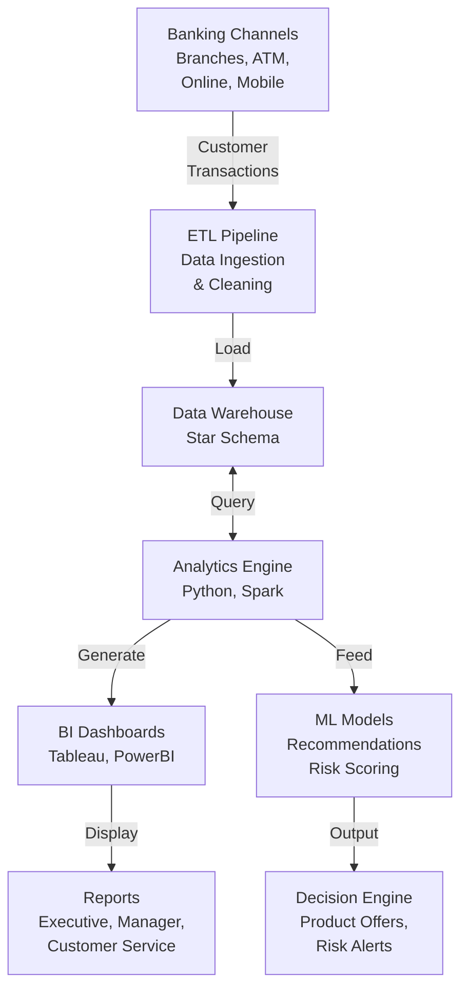
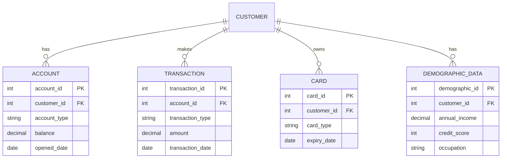
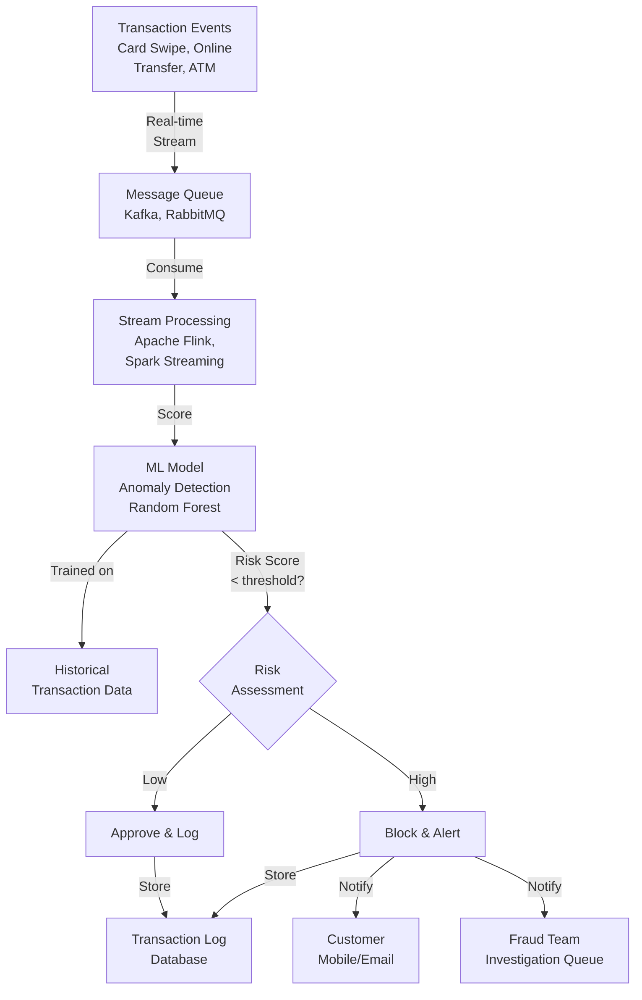
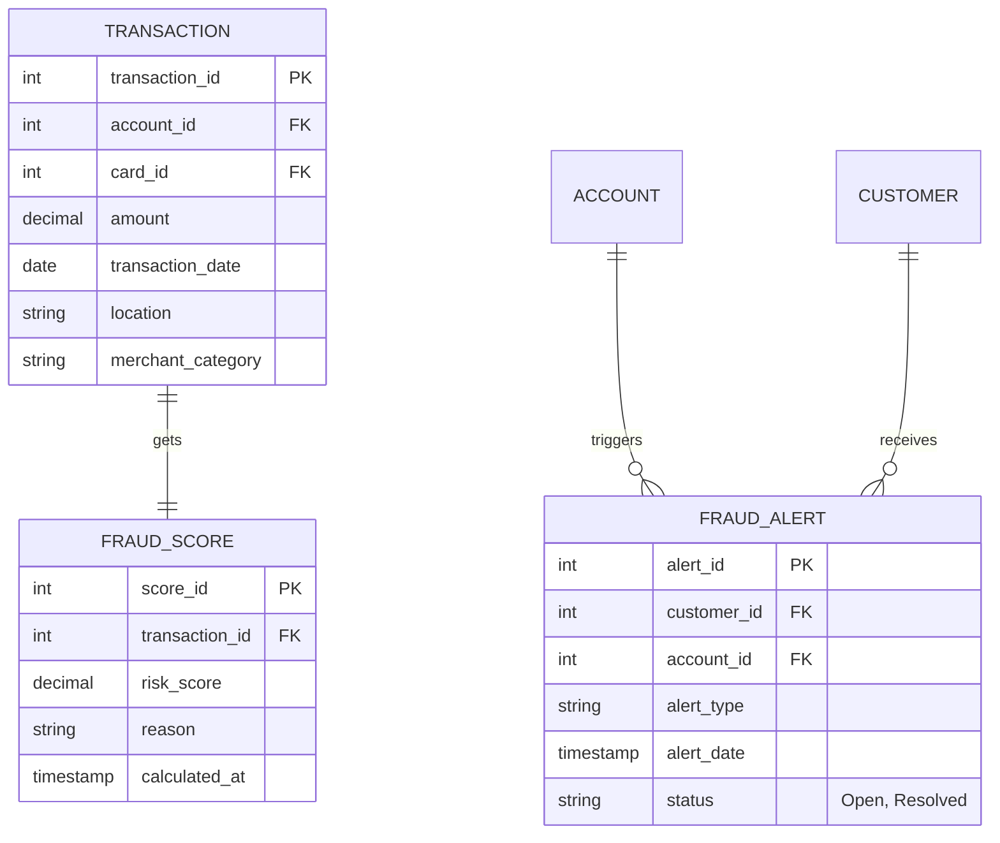
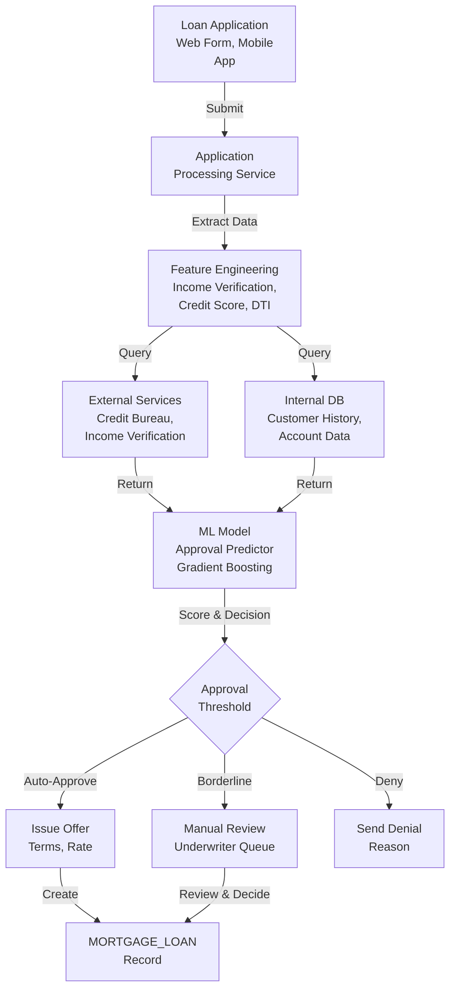
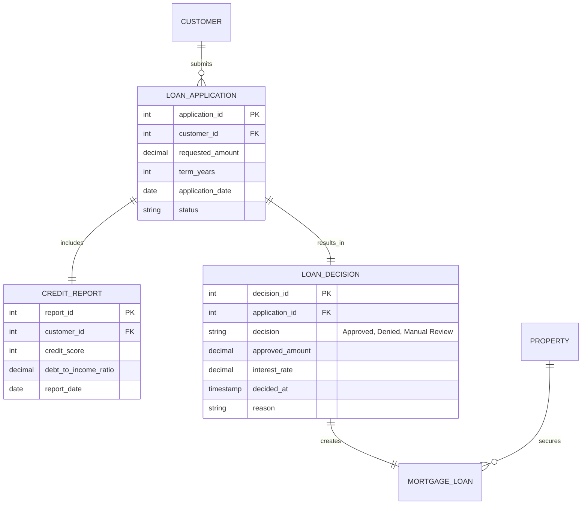
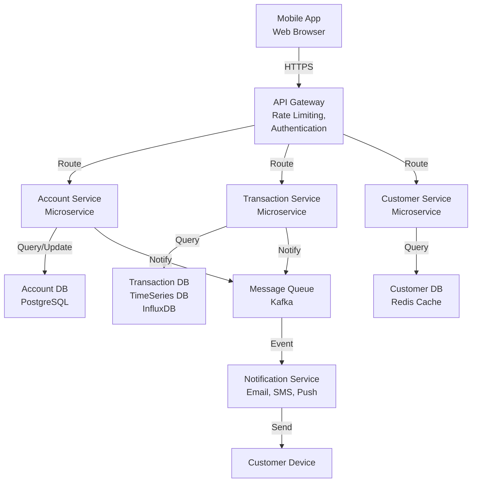
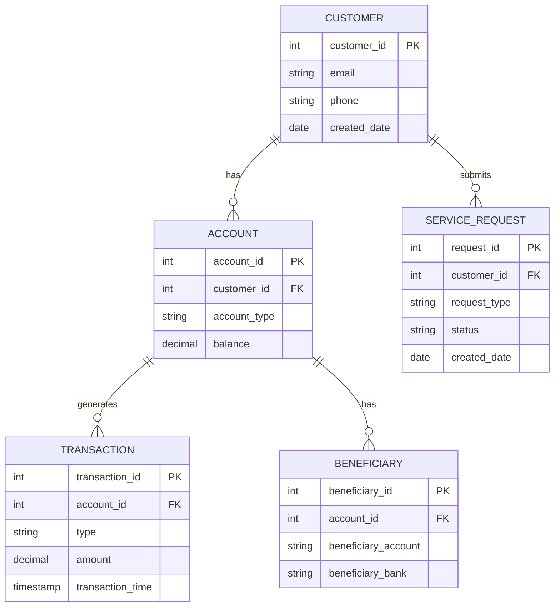
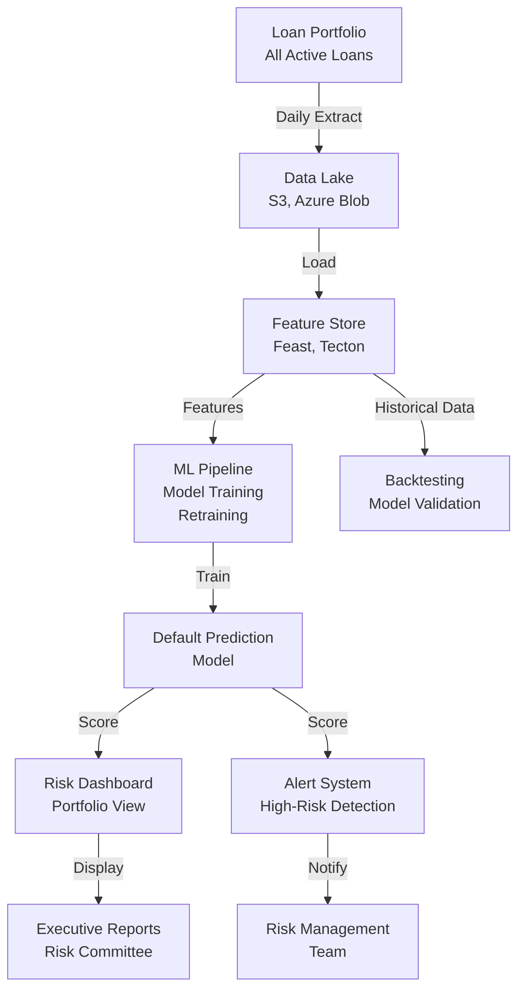
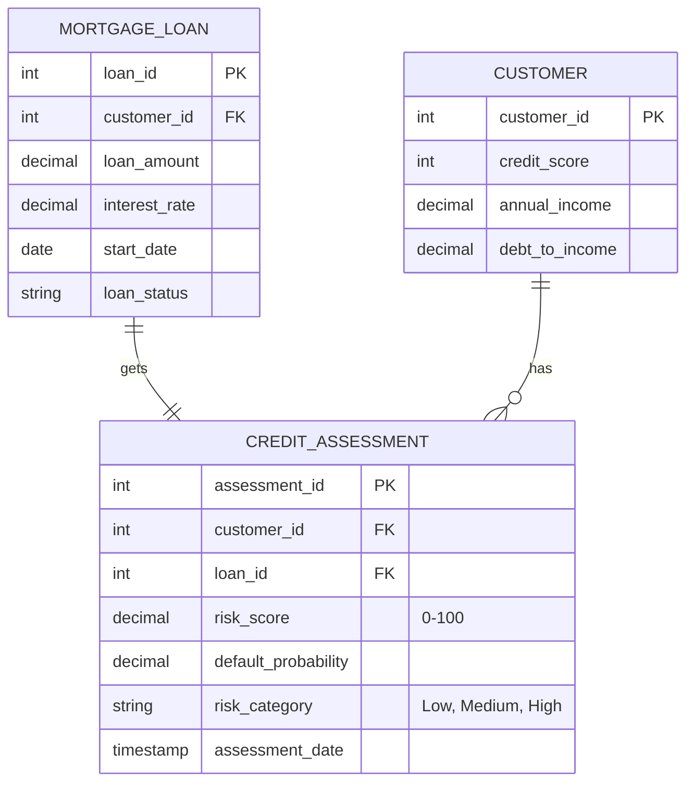

# IT Projects in the Banking Domain

This section outlines realistic IT projects that banks undertake, using the data models above. Each project is designed as a learning exercise for students to understand modern banking software architecture, data flows, and business requirements.

## Project 1: Customer 360 Analytics Platform

## project2 

### Project Objectives
- Develop a unified customer view by consolidating data from all banking channels.
- Provide real-time analytics dashboards for customer insights.
- Enable personalized product recommendations based on customer behavior.
- Reduce time to generate customer reports from hours to seconds.

### Business Objectives
- **Revenue Growth**: Cross-sell and upsell financial products by understanding customer needs.
- **Risk Management**: Identify high-risk customers and potential defaults early.
- **Customer Retention**: Improve customer experience through targeted offerings.
- **Operational Efficiency**: Reduce manual reporting effort by 80%.
- **Compliance**: Generate audit-ready reports for regulatory requirements.

### Data Flow Diagram

### Entities Used in ERD

### Technology Stack
- **Data Warehouse**: Snowflake, Redshift, or BigQuery
- **ETL Tools**: Apache Airflow, Talend, Informatica
- **Analytics**: Apache Spark, Python (Pandas, NumPy)
- **BI Tools**: Tableau, Power BI, Looker
- **ML/AI**: Scikit-learn, TensorFlow for recommendations

---

## Project 2: Real-time Fraud Detection System

### Project Objectives
- Detect fraudulent transactions in real-time (< 100ms latency).
- Reduce false positives to < 5% while catching 95% of actual fraud.
- Monitor card usage, wire transfers, and unusual account activity.
- Provide instant alerts to customers and fraud investigators.
- Block suspicious transactions automatically.

### Business Objectives
- **Risk Mitigation**: Reduce fraud losses by 60%.
- **Customer Trust**: Prevent unauthorized access to accounts.
- **Regulatory Compliance**: Meet PCI-DSS, GDPR, and fraud detection standards.
- **Cost Reduction**: Reduce manual fraud investigation by 70%.
- **Customer Experience**: Minimize false positives to avoid blocking legitimate transactions.

### Data Flow Diagram

### Entities Used in ERD

### Technology Stack
- **Real-time Streaming**: Apache Kafka, Flink, Spark Streaming
- **ML Models**: TensorFlow, Scikit-learn, XGBoost
- **Databases**: Redis (cache), MongoDB (alert logs)
- **Monitoring**: Datadog, New Relic
- **Notification**: Twilio, SendGrid

---

## Project 3: Automated Loan Approval Engine

### Project Objectives
- Automate loan application processing using ML models.
- Reduce loan approval time from 5 days to < 2 hours.
- Improve consistency in lending decisions.
- Minimize credit losses through accurate risk assessment.
- Support various loan types: personal, auto, home, business.

### Business Objectives
- **Speed to Market**: Approve qualified customers instantly.
- **Revenue**: Increase loan volume by reducing processing time.
- **Risk Management**: Lower default rates through better qualification.
- **Cost Savings**: Reduce manual underwriting labor by 85%.
- **Compliance**: Ensure fair lending practices (no discrimination).

### Data Flow Diagram

### Entities Used in ERD

### Technology Stack
- **ML Framework**: XGBoost, LightGBM, Scikit-learn
- **API Integration**: REST APIs for credit bureaus
- **Workflow Engine**: Apache Airflow, Camunda
- **Database**: PostgreSQL, MongoDB
- **Rules Engine**: Drools, easy-rules

---

## Project 4: Digital Account Management Portal

### Project Objectives
- Provide customers a comprehensive online platform to manage accounts.
- Enable account creation, transfers, bill payments, and service requests.
- Display real-time account balances and transaction history.
- Support multi-factor authentication for security.
- Mobile-first, responsive design.

### Business Objectives
- **Customer Engagement**: Increase online banking adoption by 40%.
- **Operational Efficiency**: Reduce branch foot traffic by 30%.
- **Revenue**: Enable cross-selling through the platform.
- **Customer Satisfaction**: Improve NPS by offering convenient services.
- **Security**: Reduce unauthorized access incidents.

### Data Flow Diagram

### Entities Used in ERD

### Technology Stack
- **Frontend**: React.js, Angular, Vue.js
- **Backend**: Node.js, Spring Boot, Python FastAPI
- **Microservices**: Docker, Kubernetes
- **API**: GraphQL, REST
- **Authentication**: OAuth 2.0, JWT, MFA (Twilio Authy)
- **Databases**: PostgreSQL, Redis, MongoDB

---

## Project 5: Credit Risk Analysis Engine

### Project Objectives
- Build a comprehensive credit risk scoring model for all customer segments.
- Predict loan default probability to set appropriate interest rates.
- Monitor portfolio risk in real-time.
- Generate risk reports for senior management and regulators.
- Support stress testing scenarios.

### Business Objectives
- **Profitability**: Set interest rates based on accurate risk assessment.
- **Asset Quality**: Reduce non-performing loans by 25%.
- **Regulatory Compliance**: Meet Basel III capital requirements.
- **Portfolio Management**: Identify and manage concentration risk.
- **Strategic Planning**: Inform lending strategy through risk insights.

### Data Flow Diagram

### Entities Used in ERD

### Technology Stack
- **ML Framework**: Python, TensorFlow, Scikit-learn
- **Big Data**: Spark, Hadoop
- **Feature Store**: Feast, Tecton
- **Workflow**: Apache Airflow
- **Visualization**: Jupyter Notebooks, Tableau
- **Databases**: Snowflake, BigQuery
